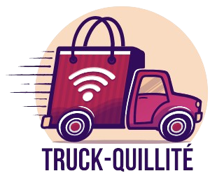

<p align="center">
    
</p>

# Truck-Quility: A Web App to Solve the Vehicle Routing Problem (VRP)

Truck-Quility is a web application designed to help logistics and transportation companies solve the Vehicle Routing Problem (VRP). The app optimizes the routing of delivery trucks based on constraints, such as distance and vehicle capacities, helping businesses reduce costs and improve efficiency.

## Features

- **Route Optimization**: Calculates the most efficient routes for multiple vehicles to deliver goods to a set of locations.
- **Multiple Solution**: Several algorithms are available.
- **Interactive Map**: Visualize optimized routes and delivery points on an interactive map.
- **Customizable Constraints**: Users can enter custom constraints, such as vehicle capacity, and algorithm parameters.
- **User-friendly Interface**: Simple and intuitive design for easy configuration and viewing of optimized routes.

## Problem Addressed

The Vehicle Routing Problem (VRP) involves finding the optimal routes for a fleet of vehicles to deliver goods to a set of locations while minimizing costs and adhering to constraints like delivery times, vehicle capacities, and road restrictions.

Truck-Quility provides an easy-to-use solution for companies to tackle the complexities of this optimization problem, saving time, fuel, and resources.

- **Algorithm**:
  - Ant Colony Optimization
  - Tabu research
  - Genetics

## Installation

### Prerequisites

- Python (v3.8 or later)
- OpenRouteService key

### Steps to Run Locally

1. Clone the repository:

   ```bash
   git clone https://github.com/yourusername/Truck-Quility.git (BON LIEN)

